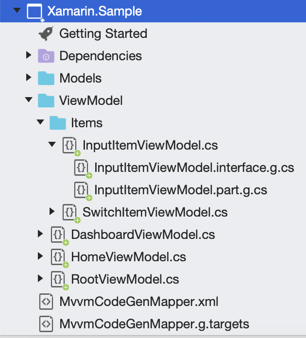

MVVM code generator tool for .NET.

## Install

Available on [NuGet](https://www.nuget.org/packages/MvvmCodeGenerator).

## Why ?

I decided to create this tool to avoid having to always write boilerplate code for my ViewModels. This NuGet is built on top of the [Rosyln .NET compiler](https://github.com/dotnet/roslyn).

The advantages of using it are :
*   Reduce the amount of code in your ViewModels
*   The ViewModels only contains the more important code
*   Migrate from one MVVM Framework to another easily

## Features

This NuGet allows you to generate your ViewModels with the Properties and Commands specified in your XML file. The code generated will depend on the Mvvm Frameworks you like.

This tool now support these MVVM Frameworks:

* [MvvmLightLibs](https://www.nuget.org/packages/MvvmLightLibs/)
* [MvvmCross](https://www.nuget.org/packages/MvvmCross/)
* [Mvvmicro](https://www.nuget.org/packages/Mvvmicro/)
* [FreshMvvm](https://www.nuget.org/packages/FreshMvvm/)

## Usage
### Setup

First of all, install the [NuGet](https://www.nuget.org/packages/MvvmCodeGenerator) package to your .NetStandard project for example.
Then create a new file called `MvvmCodeGenMapper.xml` at the root of your library project. This file will contain the definition of your ViewModels.

### Configure your generator

Now it's time to define which generator we want to use, 4 options are available:
* mvvmlightlibs
* mvvmcross
* mvvmicro
* freshmvvm

Choose the one you like and declare it inside your `MvvmCodeGenMapper.xml` like this:

```xml
<?xml version="1.0" encoding="UTF-8" ?>
<Resources>
    <Generator Value="mvvmlightlibs" />
</Resources>    
```

### Create your ViewModels

Let's define the ViewModels inside the `ViewModels` tags. You can define as many `ViewModels` tags as needed. Here is an example:

```xml
<ViewModels Namespace="MvvmCodeGenerator.Sample" DestinationFolder="ViewModel">
    <ViewModel Key="Root">
          <Property Name="IsLoading" Type="bool" Description="Gets or sets the loader property." />
    </ViewModel>
    <ViewModel Key="Dashboard"  Base="Root">
        <Property Name="Title" Type="string" Description="Gets or sets the title." />
        <Command Name="Buy" Description="Gets or sets the command to buy a boat" />
        <AsyncCommand Name="Consultation" Parameter="string" CanExecute="true" Description="Gets or sets the command to consult my orders" />
    </ViewModel> 
</ViewModels>       
```

As you can see above, you can specify a list of ViewModels for a specific namespace and destination folder.

This XML will generate the 2 ViewModels with their **.g.cs** class associated:

The `RootViewModel.cs`:
```csharp
namespace MvvmCodeGenerator.Sample
{
    using System;
    using System.Collections.Generic;
    using System.Threading;
    using System.Threading.Tasks;
    using GalaSoft.MvvmLight.Command;

    public partial class RootViewModel
    {
    }
}
```

The `RootViewModel.interface.g.cs`:
```csharp
//------------------------------------------------------------------------------ 
// <auto-generated> 
// This code was generated by MvvmCodeGenerator.
// Runtime Version:4.0.30319.42000
// 
// Changes to this file may cause incorrect behavior and will be lost if
// the code is regenerated.
// </auto-generated> 
//------------------------------------------------------------------------------
namespace MvvmCodeGenerator.Sample
{
    using System;
    using System.Collections.Generic;
    using System.Threading;
    using System.Threading.Tasks;
    using GalaSoft.MvvmLight.Command;

    public interface IRootViewModel : System.ComponentModel.INotifyPropertyChanged
    {
        System.Boolean IsLoading
        {
            get;
        }
    }
}
```

The `RootViewModel.part.g.cs`:
```csharp
//------------------------------------------------------------------------------ 
// <auto-generated> 
// This code was generated by MvvmCodeGenerator.
// Runtime Version:4.0.30319.42000
// 
// Changes to this file may cause incorrect behavior and will be lost if
// the code is regenerated.
// </auto-generated> 
//------------------------------------------------------------------------------
namespace MvvmCodeGenerator.Sample
{
    using System;
    using System.Collections.Generic;
    using System.Threading;
    using System.Threading.Tasks;
    using GalaSoft.MvvmLight.Command;

    public partial class RootViewModel : GalaSoft.MvvmLight.ViewModelBase, MvvmCodeGenerator.Sample.IRootViewModel
    {
        private System.Boolean isLoading;
        /// <summary>
        // Gets or sets the loader property.
        /// </summary>
        public System.Boolean IsLoading
        {
            get => this.isLoading;
            set => this.Set(ref this.isLoading, value);
        }
    }
}
```

The `DashboardViewModel.cs` where you will implement the Commands declared:

```csharp
Folder destination ./MvvmCodeGenerator.Dev/ViewModel
namespace MvvmCodeGenerator.Sample
{
    using System;
    using System.Collections.Generic;
    using System.Threading;
    using System.Threading.Tasks;
    using GalaSoft.MvvmLight.Command;

    public partial class DashboardViewModel
    {
    }
}
```

The `DashboardViewModel.interface.g.cs`:
```csharp
//------------------------------------------------------------------------------ 
// <auto-generated> 
// This code was generated by MvvmCodeGenerator.
// Runtime Version:4.0.30319.42000
// 
// Changes to this file may cause incorrect behavior and will be lost if
// the code is regenerated.
// </auto-generated> 
//------------------------------------------------------------------------------
namespace MvvmCodeGenerator.Sample
{
    using System;
    using System.Collections.Generic;
    using System.Threading;
    using System.Threading.Tasks;
    using GalaSoft.MvvmLight.Command;

    public interface IDashboardViewModel : MvvmCodeGenerator.Sample.IRootViewModel
    {
        System.String Title
        {
            get;
        }

        System.Windows.Input.ICommand BuyCommand
        {
            get;
        }

        System.Windows.Input.ICommand ConsultationCommand
        {
            get;
        }
    }
}
```

The `DashboardViewModel.part.g.cs`:
```csharp
//------------------------------------------------------------------------------ 
// <auto-generated> 
// This code was generated by MvvmCodeGenerator.
// Runtime Version:4.0.30319.42000
// 
// Changes to this file may cause incorrect behavior and will be lost if
// the code is regenerated.
// </auto-generated> 
//------------------------------------------------------------------------------
namespace MvvmCodeGenerator.Sample
{
    using System;
    using System.Collections.Generic;
    using System.Threading;
    using System.Threading.Tasks;
    using GalaSoft.MvvmLight.Command;

    public partial class DashboardViewModel : MvvmCodeGenerator.Sample.RootViewModel, MvvmCodeGenerator.Sample.IDashboardViewModel
    {
        private System.String title;
        private GalaSoft.MvvmLight.Command.RelayCommand buyCommand;
        private GalaSoft.MvvmLight.Command.RelayCommand<string> consultationCommand;
        /// <summary>
        // Gets or sets the title.
        /// </summary>
        public System.String Title
        {
            get => this.title;
            set => this.Set(ref this.title, value);
        }

        /// <summary>
        // Gets or sets the command to buy a boat
        /// </summary>
        public System.Windows.Input.ICommand BuyCommand
        {
            get => this.buyCommand ?? (this.buyCommand = new GalaSoft.MvvmLight.Command.RelayCommand(ExecuteBuyCommand)); // You must implement the following method(s): ExecuteBuyCommand and OnExecuteBuyCommandAsyncError
        }

        /// <summary>
        // Gets or sets the command to consult my orders
        /// </summary>
        public System.Windows.Input.ICommand ConsultationCommand
        {
            get => this.consultationCommand ?? (this.consultationCommand = new GalaSoft.MvvmLight.Command.RelayCommand<string>(async (value) =>
            {
                try
                {
                    await ExecuteConsultationCommandAsync(value);
                }
                catch (System.Exception ex)
                {
                    OnExecuteConsultationCommandAsyncError(ex);
                }
            }

            , CanExecuteConsultationCommand)); // You must implement the following method(s): ExecuteConsultationCommandAsync and the CanExecuteConsultationCommand and OnExecuteConsultationCommandAsyncError
        }
    }
}
```

Now you juste have to implement the commands in each *ViewModel.cs* file.

Each `ViewModel` tag has different properties :

* **Key** : The ViewModel name prefix
* **Base** : The ViewModel name prefix of the parent class

If you want to generate an ItemViewModel for each items of a listview for example. To generate it, just use the `ÌtemViewModel` instead of the `ViewModel` tag. You will have the same properties than the `ViewModel` tag available.

You can specify the **Properties** and **Commands** for each ViewModels:

For the **Properties** you have the ability to define it using the `Property` tag:

* **Name** : The name of the property
* **Description** : The comment associated to the property
* **Type** : The type of the property

You have different options to specify the **Type** of your property

Here the list of base types that can be used:

* **string**
* **int**
* **long**
* **bool**
* **float**
* **object**
* **double**
* **DateTime**
* **DateTimeOffset**
* **TimeSpan**

If the type you need is not in this list, you can just specify it using the complete namespace for example:

```xml
<Property Name="House" Type="Xamarin.Sample.Models.House" Description="Gets or sets the house." />
```

You can also declare a list like this:
```xml
<Property Name="names" Type="list string" Description="Gets or sets all names." />
<Property Name="AllHouses" Type="list Xamarin.Sample.Models.House" Description="Gets or sets all houses." />
```

For the **Commands** you have the ability to define:

* Synchronous command using the `Command` tag
* Asynchronous command using the `AsyncCommand` tag

Each command tag has different properties:
* **Name** : The name of the command
* **Parameter** : The parameter type of the command
* **CanExecute** : A boolean to know if the command must have a can execute method or not
* **Description** : The comment associated to the command

### Visual Studio display

If you build your project now, you will have this kind of result:


If your files are not grouped correctly like above, please check if the `MvvmCodeGenMapper.g.targets` file was imported correctly in your *.csproj* associated to your project. If it's not the case you can do it manually by adding this line:

```xml
<Import Project="MvvmCodeGenMapper.g.targets" />
```

Relaod your project and you will be good to go.

You will find a full example in the `Xamarin.Sample` project [here](https://github.com/damienaicheh/MvvmCodeGenerator/tree/master/Sources/Xamarin.Sample)


## Contributions

Contributions are welcome! If you find a bug  or if you want a feature please report it.

If you want to contribute create a branch from the current master branch and when your code is ready create a pull request.

### License

 

© [Damien Aicheh](https://damienaicheh.github.io/)
